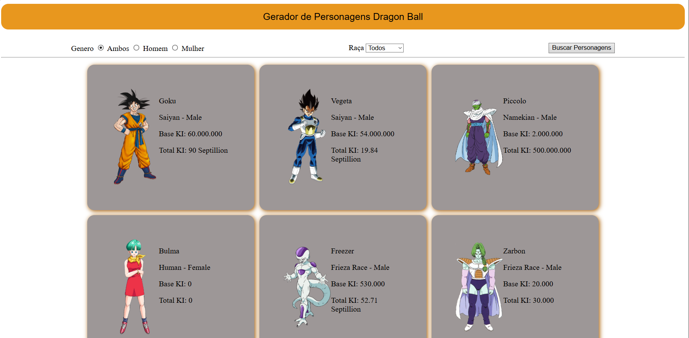

# Personagens do Dragon Ball
Projeto criado durante aulas de Programação Web usando HTML, CSS, JavaScript com implementação de uma API (https://web.dragonball-api.com) publica para pesquisar projetos do universo de Dragon Ball Z


<div align="center">
  
  <b>`プ ロ グ ラ マ`</b>
  <br>
  <samp>
      Hi there! I'm <b>Valakzz</b> 👋
      <br>
      Kotlin • Back-end • Dev in progress
  </samp>
  #

</div>


## Design do Projeto


## Detalhes do uso de API

O endpoint da API para pesquisar os personagens foi o seguinte:

```
https://dragonball-api.com/api/characters
```
#
## ✅ Funcionalidades Implementadas

- [x] Buscar todos os personagens  
- [x] Buscar por raça  
- [x] Buscar por gênero  
- [x] Música de fundo ao carregar a página  

## 🚀 Próximas Melhorias

- [ ] Tema escuro e claro  
- [ ] Buscar mais raças  
- [ ] Melhorar o design   